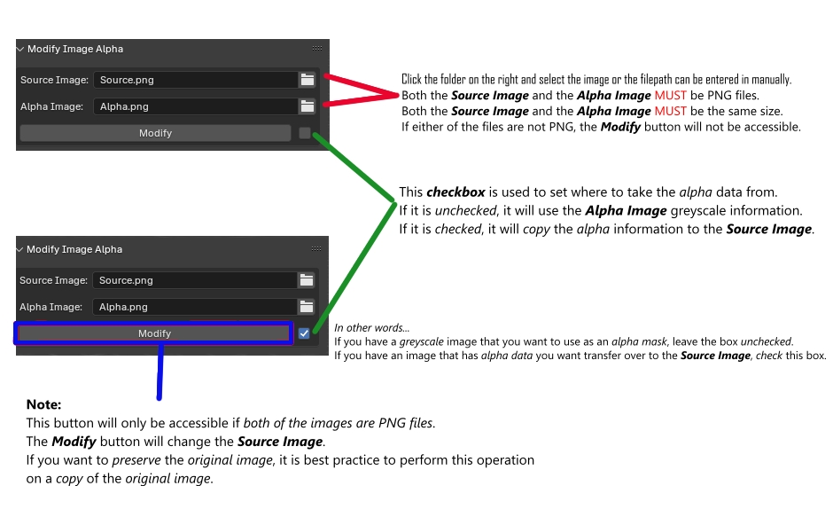

# ***Modify Image Alpha***

### This is a Blender Add-on that modifies the alpha data of a *Source Image* based on the data from an image mask.

Both images **MUST** be PNG files of the same size.  
The *Alpha Image* must be either a greyscale image or an image with alpha data to transfer to the *Source Image*. 
There is a *checkbox* to indicate where to take the alpha data from. 
*Check* the box to trnasfer the *alpha* data to the *Source Image*. 
*Uncheck* the box to use a *greyscale* mask as the alpha data to transfer to the *Source Image*.
By default it is left *unchecked*.

## Installation

1) *Download* the .zip file.
2) Open the Preferences Panel.
3) Open the *Add-ons* Tab.
4) Click on the *drop-down* button on the top right.
5) Select *Install from Disk*
6) Navigate to the .zip location.
7) Select the ***Modify_Image_Alpha.zip***
